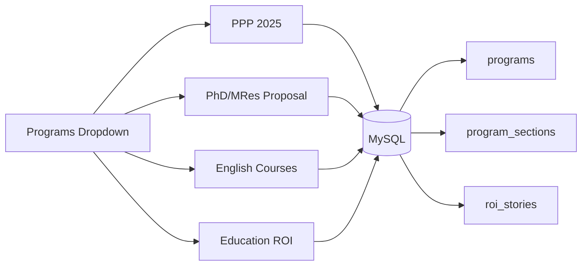
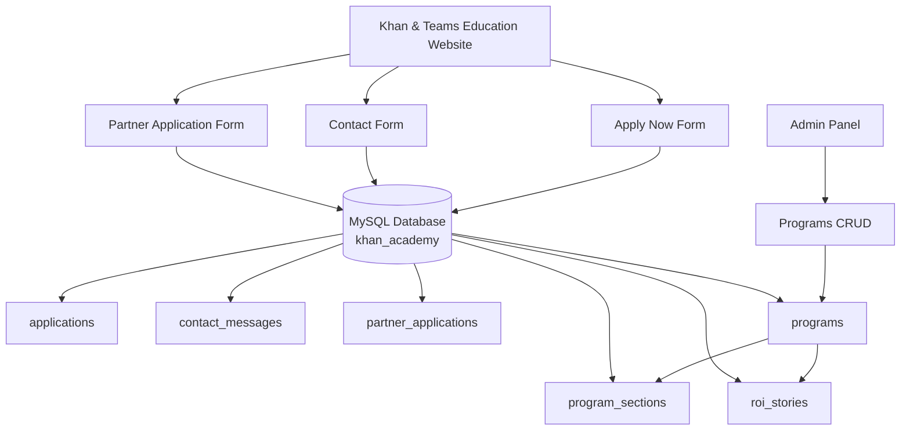
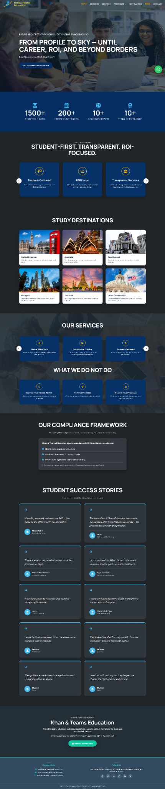
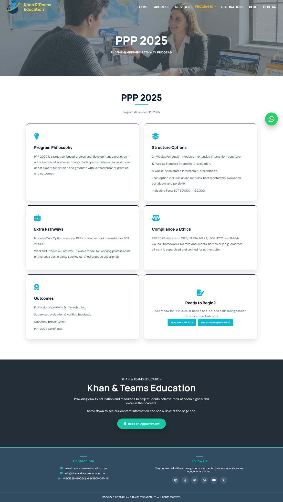
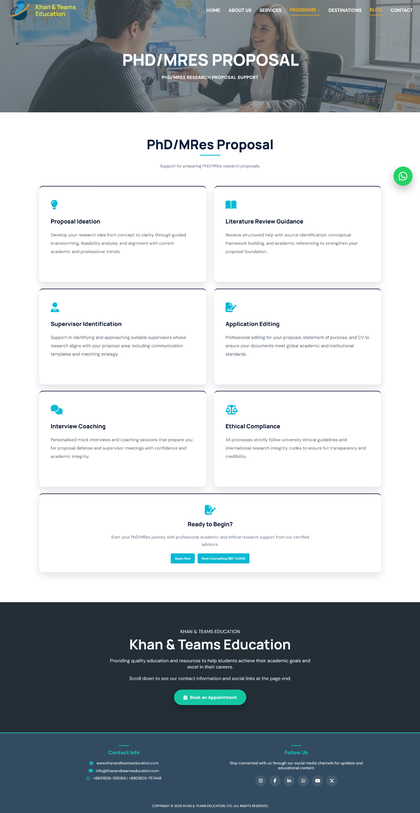
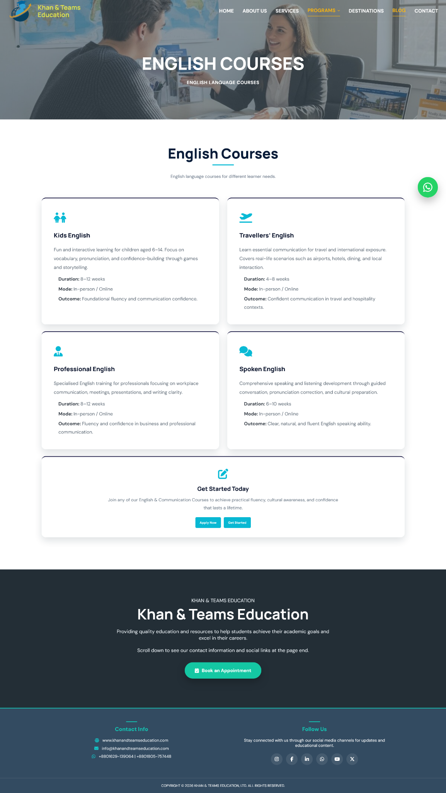
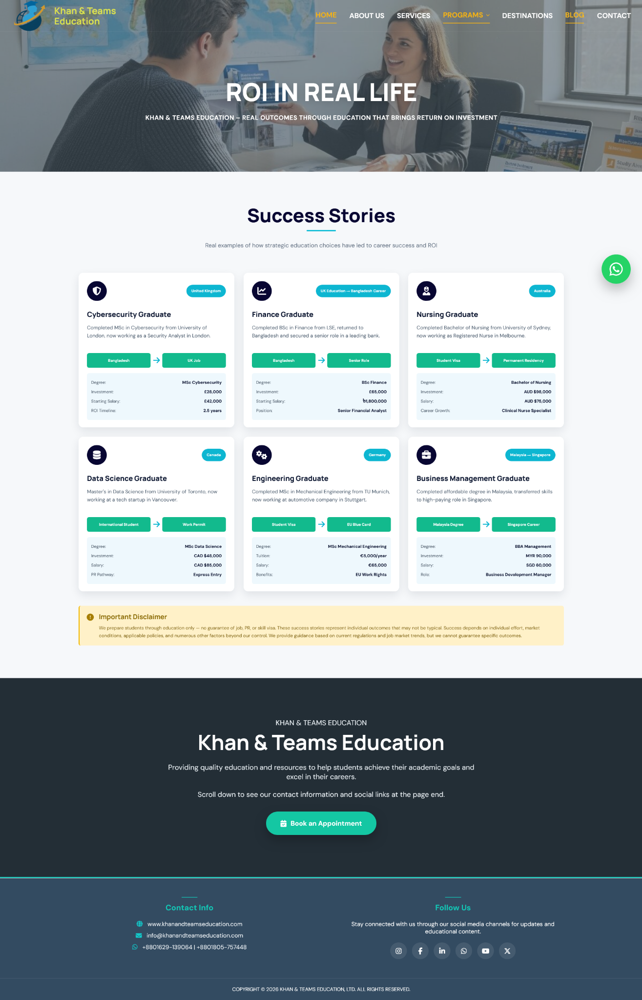

# Khan & Teams Education Website

> A responsive PHP and MySQL based education consultancy website developed as an academic and industrial attachment project.

<p align="center">
  
  
  
  
  
  
</p>

---

## Project Overview

**Khan & Teams Education** is a responsive education consultancy website developed with **PHP, MySQL, HTML, CSS, and JavaScript**.

The project combines a modern consultancy-style frontend with a functional backend for:

- Dynamic program information
- Database-connected forms
- Program CRUD operations
- Application and message management
- Reusable website components
- Responsive layouts
- Administrative data management

The website includes reusable header and footer components, dedicated program pages, database-driven content, user submission forms, and an admin panel for program and submission management.

---

## Objectives

- Build a responsive and user-friendly education consultancy website.
- Develop the website using PHP and MySQL with XAMPP.
- Connect frontend pages with a relational database.
- Display program information dynamically from MySQL.
- Store application, contact, and partner form submissions.
- Implement CRUD operations for program management.
- Create an admin area for managing programs and submitted data.
- Maintain a clean and reusable project structure.

---

## Key Features

### Responsive Website Interface

- Responsive navigation bar
- Programs dropdown menu
- Hero and banner sections
- Service cards
- Study destination cards
- Student success stories
- Call-to-action sections
- Reusable footer
- Mobile-responsive layouts
- Floating WhatsApp button
- Back-to-top interaction

### Main Website Pages

| Page | Description |
| --- | --- |
| **Home** | Main landing page with services, destinations, statistics, success stories and CTA |
| **About Us** | Company overview, mission, values and compliance information |
| **Services** | Education consultancy services and service descriptions |
| **Contact** | Payment information, partner programme and contact forms |
| **Apply Now** | Student application form |
| **PPP 2025** | Dynamic Professional Practice Programme details |
| **PhD/MRes Proposal** | Dynamic research proposal and supervisor support details |
| **English Courses** | Dynamic English and communication course details |
| **Education ROI Add-ons** | Dynamic ROI success stories |

---

## Dynamic Programs

Program information is connected to MySQL rather than being fully hardcoded in the program pages.

The program system uses:

- `programs`
- `program_sections`
- `roi_stories`

Program detail pages retrieve their data from the database using program slugs.



---

## Form Processing

The website contains three database-connected submission systems.

### Application Form

`apply.now.php` collects:

- Full Name
- Email
- Phone Number
- Address

Submissions are stored in:

```text
applications
```

### Contact Form

The Contact page collects:

- Full Name
- Email Address
- Phone Number
- Destination Interest
- Message
- PPP Interest

Submissions are stored in:

```text
contact_messages
```

### Partner Application Form

The Partner Application form collects:

- Full Name
- Agency Name
- Country
- Phone Number
- Email Address
- Experience
- Agreement

Submissions are stored in:

```text
partner_applications
```

---

## Database Workflow



---

## Admin Panel

The admin area currently includes:

- Dashboard
- Program listing
- Add Program
- Edit Program
- Delete Program
- Application listing
- Contact message listing
- Application status update
- Contact message status update

### Program CRUD

| Operation | Implementation |
| --- | --- |
| **Create** | Add a new program |
| **Read** | Display programs from MySQL |
| **Update** | Edit existing program information |
| **Delete** | Remove a program |

---

## Database Design

Database name:

```text
khan_academy
```

### Main Tables

| Table | Purpose |
| --- | --- |
| `programs` | Stores program information |
| `program_sections` | Stores sections/cards for program detail pages |
| `roi_stories` | Stores Education ROI success stories |
| `applications` | Stores student applications |
| `contact_messages` | Stores contact form messages |
| `partner_applications` | Stores partner applications |
| `leads` | Lead collection structure |
| `blogs` | Blog management structure |
| `admin_users` | Admin user structure |

Database setup and starter data:

```text
database/khan_academy.sql
```

---

## Project Structure

```text
Khan-and-Teams-Education/
│
├── admin/
│   ├── add-program.php
│   ├── applications.php
│   ├── delete-program.php
│   ├── edit-program.php
│   ├── index.php
│   ├── messages.php
│   └── programs.php
│
├── assets/
│   └── images/
│       ├── about-bg.jpg
│       ├── australia.jpg
│       ├── hero-bg.jpg
│       ├── logo.png
│       ├── malaysia.jpg
│       ├── new-zealand.jpg
│       ├── other-destinations.jpg
│       ├── services-bg.jpg
│       ├── thailand.jpg
│       └── uk.jpg
│
├── config/
│   └── database.php
│
├── css/
│   └── style.css
│
├── database/
│   └── khan_academy.sql
│
├── includes/
│   ├── footer.php
│   └── header.php
│
├── js/
│   └── script.js
│
├── roi/
│   └── index.php
│
├── screenshots/
│   ├── english-courses.png
│   ├── home-desktop.png
│   ├── home-mobile.png
│   ├── phd-mres.png
│   ├── ppp.png
│   ├── roi.png
│   ├── project-structure-bottom.png
│   └── project-structure-top.png
│
├── about.php
├── apply.now.php
├── contact.php
├── english_courses.php
├── index.php
├── phd_proposal.php
├── ppp.php
├── programs.php
├── services.php
├── .gitignore
└── README.md

### Folder Responsibilities

| Folder | Responsibility |
| --- | --- |
| `admin/` | Backend management pages for programs, applications and contact messages |
| `assets/images/` | Website images and branding assets |
| `config/` | Database connection |
| `css/` | Main website stylesheet |
| `database/` | SQL database setup and backup |
| `includes/` | Reusable header and footer components |
| `js/` | Frontend JavaScript interactions |
| `roi/` | Education ROI page and related nested resources |

---

## Technologies

| Technology | Purpose |
| --- | --- |
| **PHP** | Server-side development and database operations |
| **MySQL** | Relational database |
| **HTML5** | Website structure |
| **CSS3** | Responsive styling and visual design |
| **JavaScript** | Frontend interactions |
| **Font Awesome** | Icons |
| **XAMPP** | Local PHP/MySQL development environment |
| **phpMyAdmin** | Database management |
| **Git & GitHub** | Version control and project hosting |

---

## Local Setup

### 1. Install XAMPP

Start:

```text
Apache
MySQL
```

### 2. Place the Project

Copy the project into:

```text
C:\xampp\htdocs\Khan-and-Teams-Education
```

### 3. Import the Database

Open:

```text
http://localhost/phpmyadmin
```

Import:

```text
database/khan_academy.sql
```

### 4. Check Database Configuration

Open:

```text
config/database.php
```

Default local configuration:

```text
Host: localhost
Database: khan_academy
Username: root
Password: empty
```

### 5. Run the Website

```text
http://localhost/Khan-and-Teams-Education/
```

### 6. Open the Admin Area

```text
http://localhost/Khan-and-Teams-Education/admin/
```

---

## Screenshots

### Home Page — Desktop


### Home Page — Mobile



### PPP 2025



### PhD/MRes Proposal



### English Courses



### Education ROI



---

## Implementation Highlights

### Reusable Components

Common website elements are separated into:

```text
includes/header.php
includes/footer.php
```

This keeps the layout consistent and reduces repeated code.

### Database Connectivity

The project uses **PDO** for MySQL connectivity through:

```text
config/database.php
```

Prepared statements are used for database-driven form processing and CRUD operations.

### Dynamic Content

Program pages retrieve information from MySQL so program data can be updated without rewriting the full page layout.

### Form Validation

Form handling includes required-field validation and email validation before inserting records into the database.

### Responsive Design

The interface adapts to desktop, tablet and mobile screen sizes.

---

## Development Status

### Completed

- [x] Responsive homepage
- [x] About page
- [x] Services page
- [x] Contact page
- [x] Application page
- [x] Programs dropdown
- [x] PPP program page
- [x] PhD/MRes program page
- [x] English Courses page
- [x] Education ROI page
- [x] MySQL database integration
- [x] Dynamic program content
- [x] Application form database storage
- [x] Contact form database storage
- [x] Partner application database storage
- [x] Admin dashboard
- [x] Program CRUD
- [x] Application management
- [x] Contact message management

---

## Future Improvements

- Secure admin authentication
- Full blog management
- Lead management interface
- Email notifications
- File upload management
- Online deployment
- Production database configuration

---

## Conclusion

This project combines a responsive frontend with a functional PHP and MySQL backend. It demonstrates practical implementation of reusable components, dynamic database-driven content, form processing, CRUD operations, and administrative data management in a real-world website structure.

---

## Project Purpose

This website was developed as an academic and industrial attachment project to gain practical experience in:

- Full-stack web development
- PHP programming
- MySQL database management
- CRUD operations
- Form processing
- Responsive UI development
- Local server deployment using XAMPP
- Version control with Git and GitHub
